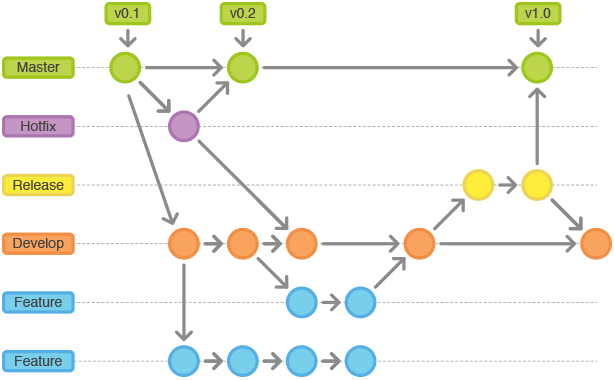

# Clase 02 - Git desarrollo colaborativo

## Repasando dinamica de trabajo base de git

## Listar una cantidad especifica de commits en el log

```sh
git log --oneline -<cantidad-commits>
git log --oneline -5
git log --oneline -10
```

### Haciendo un commit. Pasos

1. Hacer un status para ver en que estado están los archivos que quiero sean parte del commit

```sh
git status
```

2. Agregar lo que quiero dentro del commit al área de confirmación (staging area)

```sh
git add <nombre-archivo>
git add clase.02/README.md
git add . # Agregar todo lo que sea parte de la funcionalidad en la que trabajo
```

3. Hago el commit. Todo lo que estuviera en el area de staging se guarda en el repositorio local.

```sh
git commit -m "Nuevo commit, mensaje descriptivo"
```

## Git diff comparo entre diferentes commits en el tiempo

```sh
git diff <hash> <hash>
git diff 6ceff27 3760d7e #aqui van los numeritos que salieron del git log --oneline
```

## Para agregar algo que olvide o quiero incorparar en el último commit, uso el siguiente comando

```sh
git add .
git commit --amend
```
# Ramas (Branches)
Nos permiten trabajar en el proyecto de manera auxiliar.

## Listar ramas

```sh
git branch
```

## Crear un rama

```sh
git branch <nombre-rama>
git branch feature/navbar
git branch feature/footer
```

## Moverme entre ramas

```
git switch <nombre-rama>
git switch feature/navbar
```

## Crear y moverme

```sh
git switch -c <nombre-rama>
git switch -c feature/ramas
```

## Ver todas las ramas del repositorio en el log

```sh
git log --oneline --decorate --all --graph
```

## Ver detalle de las ramas y su último commit

```sh
git branch -v
```

## Borrar una rama

```sh
git branch -d <nombre-de-la-rama>
git branch -d feature/navbar
```

## Borrar una rama en forma forzada. (Seguro de que la quiero borrar)
Si los commits que estan en el rama que quiero borrar, no existen en ningun otro lado del repositorio. Me va a pedir confirmación de borrado

```sh
git branch -D feature/navbar
```

## Visualizacion de ramas en VSC

* mhutchie.git-graph

## Aplicaciones visuales para la gestión de Repositorios de GIT

* GitHub Desktop: <https://github.com/apps/desktop>
* GitKraken: <https://www.gitkraken.com/>
* Alternatives: <https://alternativeto.net/software/github-desktop/>


# Fusiones (Merge) de ramas (Branches)

## Comparando contenido de las diferentes ramas

```sh
git diff <nombre-con-cual-quiero-comparme-la-rama-actual>
git diff <nombre-rama> <nombre-rama>
```

## Tipos de fusiones en GIT

* Fusion -> fast-forward (automatico)
* Fusion -> tres vias (automatico)  (Genera un commit intermedio entre los ultimos commits de las ramas involucradas)
* Fusión -> Manual (Git no puedo solucionar el conflicto) Pide que yo como desarrollor solucione el conflicto.

## Tentativa de trabajo con ramas en un proyecto empresarial

