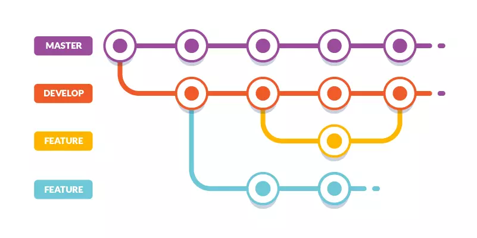

# Clase 03 - Git Desarrollo Colaborativo

## Ramas (Branches)




## Creando una rama
```sh
git branch <nombre-rama>
```
## Listar ramas dentro de un repositorio

```sh
git branch
```

## Cambiar de ramas

```sh
git switch <nombre-rama>
git switch feature/ramas
git switch - # Toogle entre las últimas 2 ramas
```
